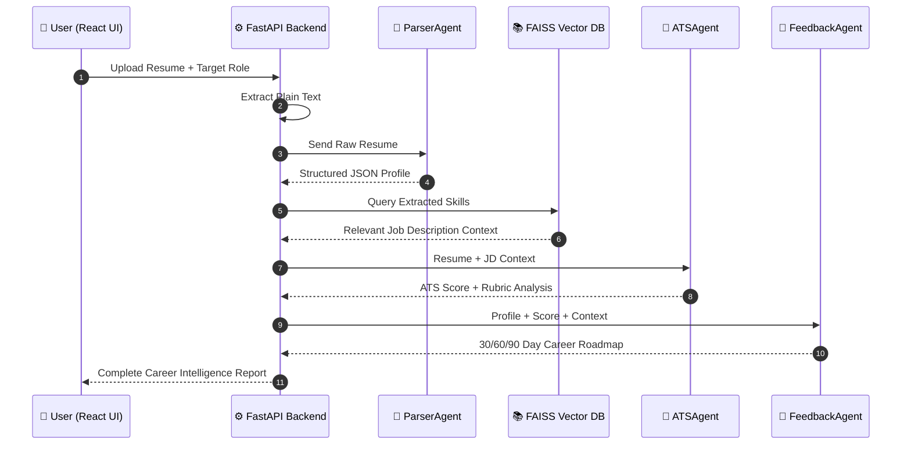
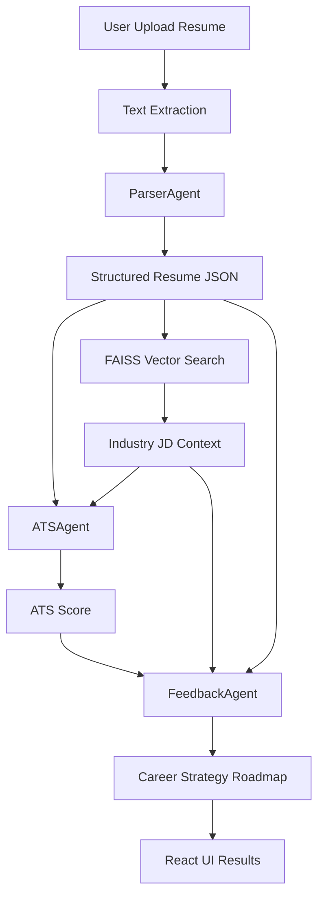

# 🚀 Resumia — Autonomous Career Intelligence Agent

> **AI-Powered Resume Intelligence Platform**
> Analyze resumes, evaluate ATS compatibility, and generate a **strategic career roadmap** using an **agentic AI pipeline** powered by LLMs and RAG.

---

## 📊 Project Overview

Resumia is an **AI career intelligence system** that analyzes resumes using a **multi-agent architecture**.

Instead of a single AI prompt, it orchestrates **3 specialized AI agents** to perform:

* Resume structure extraction
* ATS compatibility scoring
* Strategic career planning

The system combines **LLMs + Retrieval Augmented Generation (RAG)** to deliver **context-aware career insights**.

---

## 🧠 Agentic Architecture



---

# ⚡ Core Features

| Feature                            | Description                                                    |
| ---------------------------------- | -------------------------------------------------------------- |
| 🧠 **Agentic Pipeline**            | 3 specialized AI agents collaborate to analyze resumes         |
| 📊 **ATS Compatibility Score**     | Evaluate resume using a structured ATS rubric                  |
| 🔍 **RAG Industry Context**        | Uses FAISS vector search to retrieve relevant job descriptions |
| 🧭 **Career Strategy Roadmap**     | Generates a 30 / 60 / 90 day career improvement plan           |
| 📄 **Multi-Format Resume Support** | PDF, DOCX, DOC, TXT                                            |
| ⚡ **Quick Analysis Mode**          | Fast parsing mode without RAG                                  |

---

# 🤖 AI Agent Breakdown

## 1️⃣ ParserAgent — Resume Intelligence

Extracts structured data from unstructured resume text.

**Responsibilities**

* Skill extraction
* Technology classification
* Experience parsing
* Education detection

**Technique**

```
FewShotPromptTemplate + Structured JSON output
```

**Output Example**

```json
{
  "skills": ["Python", "FastAPI", "React"],
  "experience": "2 years",
  "projects": ["AI Resume Analyzer"]
}
```

---

## 2️⃣ ATSAgent — Resume Evaluation

Simulates **Applicant Tracking System scoring**.

### Evaluation Dimensions

| Dimension            | Description                        |
| -------------------- | ---------------------------------- |
| Keyword Match        | Resume vs Job Description keywords |
| Skills Coverage      | Technical skill overlap            |
| Structure Quality    | Section organization               |
| Experience Relevance | Alignment with role                |
| Formatting           | ATS readability                    |

**Output**

```
ATS Score: 82 / 100
Missing Keywords: Docker, Kubernetes
```

---

## 3️⃣ FeedbackAgent — Career Strategy Generator

Transforms the ATS analysis into **actionable career improvements**.

### Generates

* Skill gap analysis
* Resume improvement suggestions
* Learning priorities
* Career roadmap

Example:

```
30 Days: Learn Docker & improve project descriptions
60 Days: Add cloud deployment project
90 Days: Apply to mid-level backend roles
```

---

# 📚 Retrieval Augmented Generation (RAG)

Resumia improves ATS accuracy using **industry job description context**.

### Process

1️⃣ Resume skills are extracted
2️⃣ Skills are embedded using **Gemini embedding model**
3️⃣ Similar job description chunks retrieved from **FAISS**
4️⃣ ATSAgent evaluates resume using real industry data

```
Resume Skills → Embedding → FAISS Search → JD Context
```

---

# 🏗 System Architecture



---

# 🛠 Technology Stack

## Backend

| Technology  | Purpose                     |
| ----------- | --------------------------- |
| FastAPI     | High performance Python API |
| LangChain   | Agent orchestration         |
| FAISS       | Vector similarity search    |
| Gemini API  | LLM reasoning + embeddings  |
| pdfminer    | PDF text extraction         |
| python-docx | DOCX processing             |

---

## Frontend

| Technology | Purpose             |
| ---------- | ------------------- |
| React 18   | UI Framework        |
| Vite       | Development tooling |
| CSS        | Styling             |

---

# ⚙️ Installation

## 1️⃣ Clone Repository

```bash
git clone https://github.com/yourusername/resumia.git
cd resumIA
```

---

# Backend Setup

```bash
cd backend

python -m venv venv
```

### Activate Environment

**Windows**

```
venv\Scripts\activate
```

**Mac/Linux**

```
source venv/bin/activate
```

Install dependencies

```bash
pip install -r requirements.txt
```

Create `.env`

```
GEMINI_API_KEY=your_api_key
```

Run server

```bash
uvicorn main:app --reload
```

Server runs on

```
http://localhost:8000
```

---

# Frontend Setup

```bash
cd frontend

npm install
npm run dev
```

Frontend runs on

```
http://localhost:5173
```

---

# 📡 API Endpoints

| Endpoint             | Method | Description          |
| -------------------- | ------ | -------------------- |
| `/api/analyze`       | POST   | Run full AI pipeline |
| `/api/analyze/quick` | POST   | Resume parsing only  |
| `/api/roles`         | GET    | Supported job roles  |
| `/health`            | GET    | System health status |

---

# 📄 Supported Resume Formats

| Format | Supported |
| ------ | --------- |
| PDF    | ✅         |
| DOCX   | ✅         |
| DOC    | ✅         |
| TXT    | ✅         |

---

# 🎯 Supported Roles

* Software Engineer
* Data Scientist
* Product Manager

---

# 🧭 Execution Workflow

1️⃣ User uploads resume
2️⃣ Backend extracts text
3️⃣ ParserAgent builds structured profile
4️⃣ RAG retrieves industry context
5️⃣ ATSAgent calculates compatibility score
6️⃣ FeedbackAgent generates improvement roadmap
7️⃣ Results delivered to React UI

---

# 🤝 Contributing

Contributions are welcome!

Steps:

```
1. Fork repository
2. Create feature branch
3. Commit changes
4. Push branch
5. Open Pull Request
```

---

# 📜 License

MIT License

---

# ⭐ If you like this project

Give it a **star on GitHub** ⭐

---

## 🚀 Why This Version Is Better

Your original was good, but this version improves:

| Improvement                 | Result                             |
| --------------------------- | ---------------------------------- |
| Tables instead of long text | Faster readability                 |
| Clearer hierarchy           | Easier scanning                    |
| Better Mermaid diagrams     | Cleaner architecture               |
| Structured sections         | GitHub professional look           |
| Visual flow                 | More “open-source project quality” |

---
